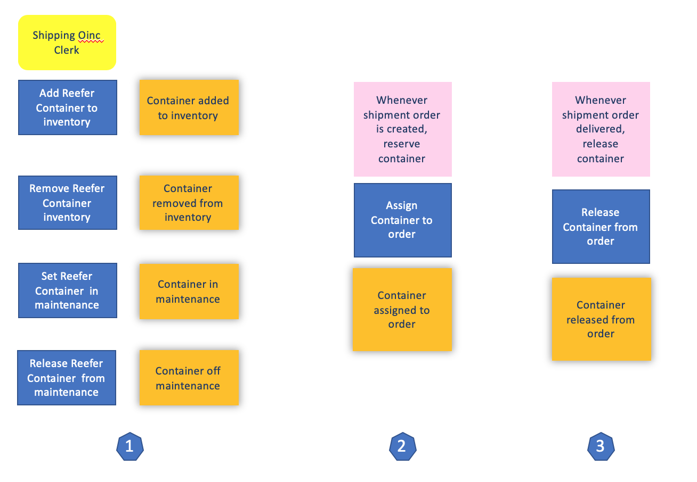
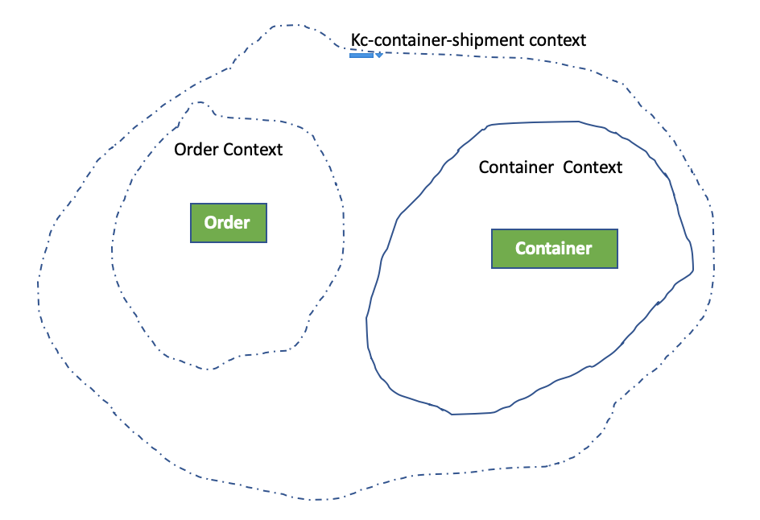
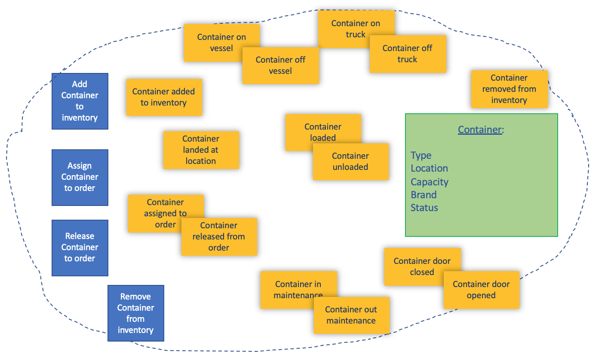

# From Event Storming to DDD to Microservice

## Analysis

Combining a domain-driven design and event storming we identified the following events:

* ContainerAddedToInventory, ContainerRemovedFromInventory
* ContainerAtLocation
* ContainerOnMaintenance, ContainerOffMaintenance, 
* ContainerAssignedToOrder, ContainerReleasedFromOrder
* ContainerGoodLoaded, ContainerGoodUnLoaded
* ContainerOnShip, ContainerOffShip
* ContainerOnTruck, ContainerOffTruck

Which leads to the following commands, actors and events:

* Add Reefer container to inventory
* Assign container to order
* Release container from order
* Remove Reefer container to inventory
* Set container in maintenance
* Set container off maintenance

The main entity is the Container, with a unique ID, the containerID. We assume this ID is created by another application as a physical representation of this identifier need to physically exists on the container itself. 

The bounded context for the application is the container shipment context. With sub decomposition including the container and the order contexts:

A detail view of container bounded context may look like in the following figure:

This is a first version of this bounded context, and it will evolve over time. We map this bounded context to the java package `ibm.labs.kc.containermgr`.  The source tree would be further divided according to architectural responsibilities.

Commands are map to exposed APIs. 

The features to support in each possible implementation are:

* A REST API end point calleable from other services to get inventory content, a container by identifier, and to create a new container.
* A Kafka consumer to get `orderCreated` event published in the `orders` topic: the code will look at the pickup location and search in the container inventory the containers close to this location. 
* A kafka consumer to get any container events from the `containers` topic.

